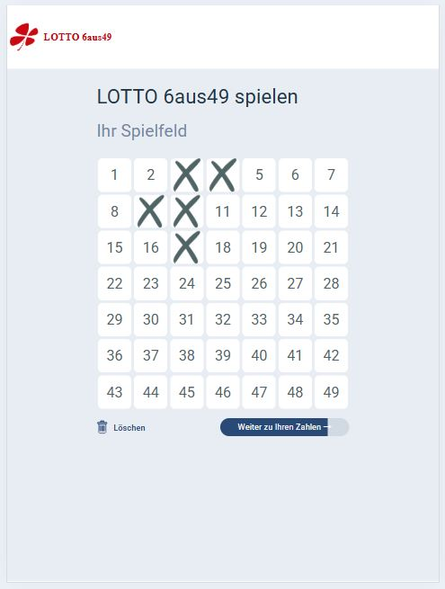
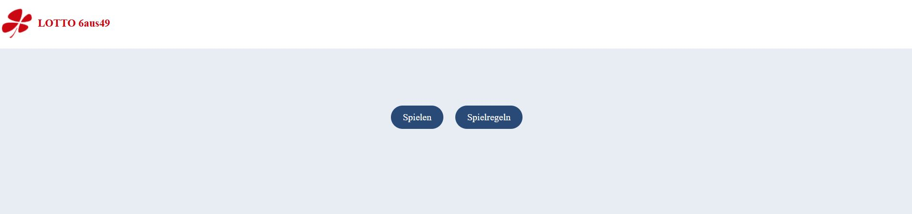

# Lotto6aus49

## Beschreibung

Spielen Sie das berühmte Lotto 6aus49. Wählen Sie die Zahlen aus und lassen Sie sie anzeigen.

## Tech stack

Erstellt mit React JS, CSS & HTML.

## Design

Die Website ist so gestaltet, dass die wichtigsten Elemente im Fokus stehen, sodass die Benutzeroberfläche leicht verständlich ist.

## Funktionen

- **Responsive Design**: Die Website ist vollständig responsiv und bietet alle Funktionen auf allen Geräten und Bildschirmgrößen.</br>
  </br>
- **Einfache Steuerung**: Eine leicht verständliche Benutzeroberfläche zum Auswählen und Abwählen von Zahlen per Klick.

## So starten Sie das Projekt

- Klicken Sie auf den Link, um die Seite im Browser zu laden.</br>
  _(https://lotto4aur49.netlify.app/)_

## Navigation durch die Website

- Startseite: Beim Laden der Website landet der Benutzer auf der Startseite.</br>
  </br>
  </br>Die Startseite besteht aus folgenden Abschnitten:</br>

  - Header: Die Kopfzeile der Website ist fixiert und ändert sich während der Navigation nicht.</br>
    Sie enthält das Website-Logo mit dem Namen. Durch Klicken auf das Logo kann der Benutzer zur Startseite navigieren.
  - Hauptinhalt: Beim ersten Laden werden zwei Buttons angezeigt: "Spielen" & "Spielregeln".

    1. Spielregeln: - Spielen: Nach der Auswahl dieses Buttons kann der Benutzer das Spiel starten.</br>
       </br>

    Es gibt zwei Steuerungen im unteren Bereich des Spiels:

    - Löschen: Löscht alle Auswahlen mit einem Klick.

    - Fortschrittsbalken: Zeigt den Fortschritt der Auswahl an. Nach Abschluss der Auswahl führt ein Klick auf dieses Element zur
      Coupon-Auswahlseite, auf der die sortierten Zahlen angezeigt werden.</br>
      </br>

    2. Spielregeln: Nach der Auswahl dieses Buttons werden dem Benutzer die Spielregeln sowie der "Spielen"-Button angezeigt.

## So richten Sie das Projekt ein

- Git clone das Projekt

```bash
  git clone https://github.com/nehais/lotto-6aus49.git
```

- Installieren Sie die benötigten Pakete

```bash
  npm i
```

- Starten Sie die Anwendung

```bash
  npm run dev
```

# Pages

1. Home.jsx<br/>
   Startseite der Anwendung.

2. Rules.jsx<br/>
   Zeigt die Spielregeln an.

3. Game.jsx<br/>
   Das Spiel wird auf dieser Seite geladen.

# Components

1. Header.jsx<br/>
   Zeigt das Logo an, das durch Anklicken zur Startseite navigieren kann.

2. GameBoard.jsx<br/>
   Container für das Spielbrett und die Steuerungen.

3. GameCell.jsx<br/>
   Zahlenzelle, die die gesamte Spiellogik aktualisiert.

4. GameProgressBar.jsx<br/>
   Logik der Fortschrittsanzeige.

5. SelectionResult.jsx<br/>
   Nach der Auswahl werden hier die sortierten Nummern angezeigt.
